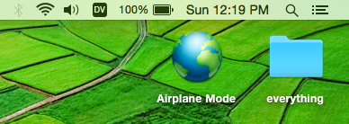
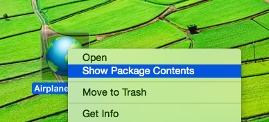

# Airplane Mode

Airplanes are programming heaven. Going on a 10+ hour flight is a recipe for extraordinary focus and productivity. I always get off these flights feeling good and having done some cool shit. I wanted that without the plane though.

Airplane Mode turns off the distracting parts of the internet, so you can read docs but not get on Facebook, Twitter, Gmail, etc.

Just click it to toggle between airplane mode and normal.

## Install

All you need is the `Airplane\ Mode.app` part (452kb). So just [download the `.zip`](https://github.com/evancz/airplane-mode/archive/master.zip) and grab it out of there.

From there just click the icon to toggle things on and off.

## Customize

This is just a wrapper around [a Python file](Airplane%20Mode.app/Contents/Resources/script) that messes with your `/etc/hosts` file. The [`on`](Airplane%20Mode.app/Contents/Resources/on) and [`off`](Airplane%20Mode.app/Contents/Resources/off) files determine how things work. You can just edit them. Add or remove websites to the list depending on your bad habits.

You can get to these files pretty easy too. Just right click the icon and go to "Show Package Contents". That will let you get at all the relevant files in Finder.

## How do I make something like this?

I made it with this [Platypus](http://www.sveinbjorn.org/platypus) thing for Mac. It was super easy and fun. Just wrote a simple Python script and was able to bundle it all up with a custom icon. Had a great experience, trying to think of more things I can automate with a simple button like this!

## Feature Request

Can someone figure out how to make the icon turn on and off depending on the status? Is that even possible? It would be sick though, so open a PR if you figure it out!